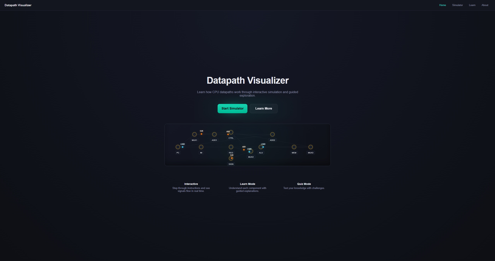
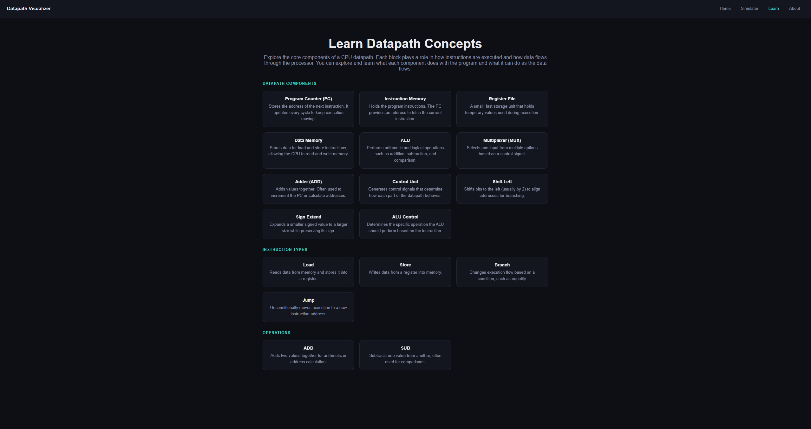
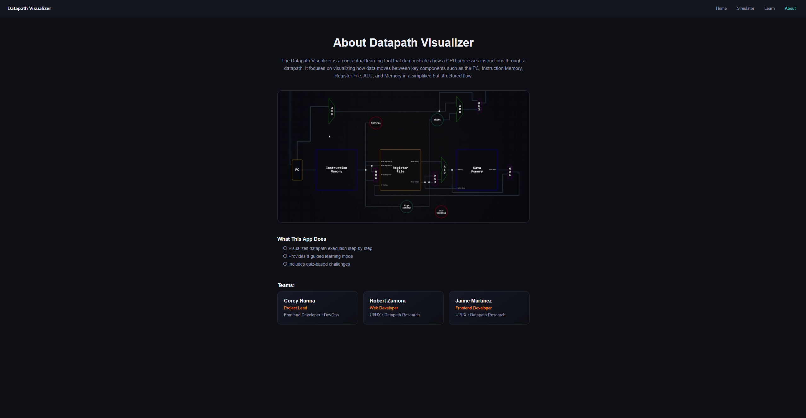
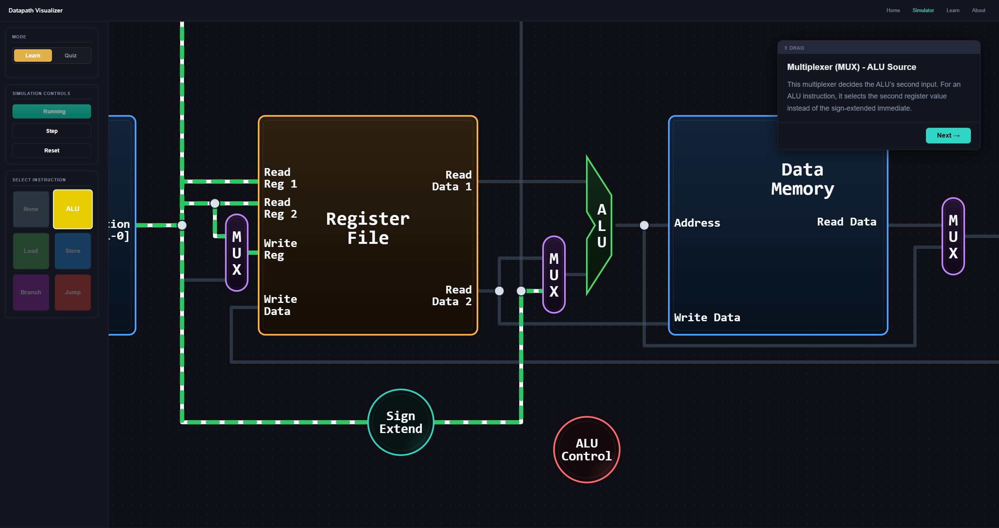
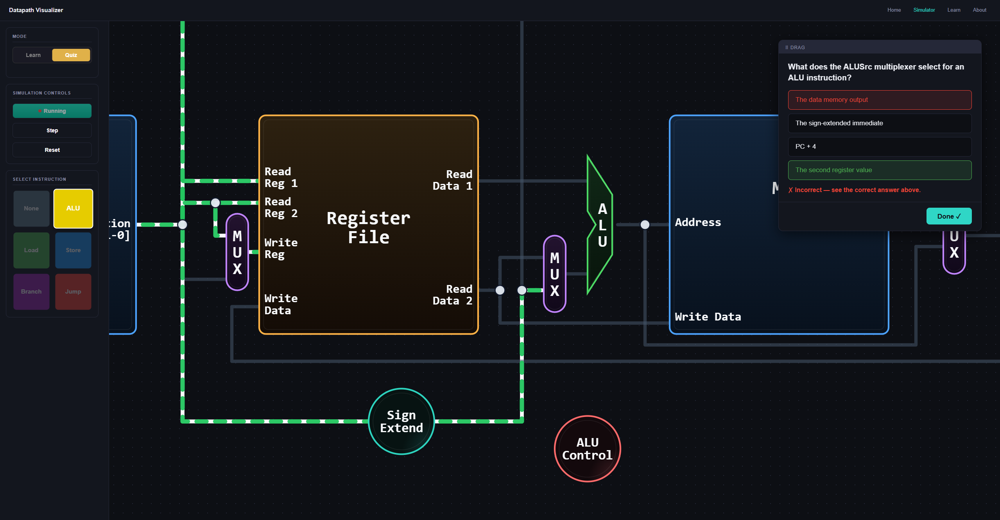

# Datapath Visualizer

An interactive web application designed to help students understand how CPU datapaths operate through visual simulation, guided instruction, and quiz-based learning. This project models a simplified MIPS-style datapath and demonstrates how data flows between core components during instruction execution.

---

## Project Overview

**Datapath Visualizer (DatapathWebApp-CS3339)** is a student project developed for the Computer Architecture course at Texas State University. The application provides an intuitive, visual approach to learning datapath behavior by combining animation, structured walkthroughs, and interactive challenges.

- **Course:** CS3339 — Computer Architecture  
- **Live Site:** https://corey-h-txst.github.io/DatapathWebApp-CS3339/  
- **Repository:** https://github.com/corey-h-txst/DatapathWebApp-CS3339  

---

## Pages

### Home Page

<p align="center">
  
</p>

### Learn Page

<p align="center">
  
</p>

### About Page

<p align="center">
  
</p>

---

## Modes

### Learn Mode

<p align="center">
  
</p>

- Step-by-step guided walkthrough of instruction execution  
- Highlights active components and data paths  
- Educational explanations at each step  

### Quiz Mode

<p align="center">
  
</p>

- Multiple-choice questions during each step  
- Immediate feedback and scoring system  
- Performance-based result tiers  

---

## Team Members

- **Corey Hanna** — Project Lead, Frontend Developer, DevOps  
- **Robert Zamora** — Web Developer, UI/UX, Datapath Research  
- **Jaime Martinez** — Frontend Developer, UI/UX, Datapath Research  

> **Note:** AI was used for documentation and debugging purposes

---

## Technology Stack

The project is intentionally lightweight and avoids frameworks to emphasize direct control over rendering and architecture.

- **Rendering:** Konva.js
- **Architecture:** Vanilla JavaScript 
- **Styling:** Custom CSS 
- **Build System:** None (runs directly in browser)  
- **Hosting:** GitHub Pages (static deployment)  

---

## Features

### Interactive Datapath Canvas
- 16 components rendered using Konva.js, including a new AND Gate for branch control  
- "4" constant label displayed on the PC adder input port  
- Smooth zoom and pan functionality  
- Camera animations that follow instruction flow  

### Instruction Simulation
Supports 5 core instruction types:
- ALU (R-type)  
- Load (`lw`)  
- Store (`sw`)  
- Branch (`beq`)  
- Jump (`j`)  

### Animated Wires
- 26 permanent data-flow wires with dynamic highlighting  
- 20+ control wires displayed as dashed, color-coded signals  
- Pulsing animations to indicate active data movement  
- Wire states (active/inactive) maintained cumulatively across simulation steps  
- Camera animations follow wire paths for step-by-step instruction flow  

### Camera System
- Smooth transitions between components  
- Path-following animations for signal flow  
- Focus-based zooming for clarity  

### Additional Pages
- **Home Page:** Abstract Datapath animation and basic info  
- **Learn Page:** Reference cards for components and instructions  
- **About Page:** Project overview and team information  

---

## Architecture

### Routing
- `pages/router.js`  
- Handles client-side navigation  

### State Management
- `src/state.js`  
- Centralized control of:
  - Current mode (learn or quiz)  
  - Selected instruction  
  - Step progression  
  - Quiz scoring  

### Canvas System
- `datapath/canvas.js`  
- Manages:
  - Konva stage  
  - Zoom and pan constraints  
  - Resize handling  
  - Camera animations  

### Components
- `datapath/components.js`  
- Defines 16 datapath components, including an AND Gate for branch control  
- Supports multiple shapes:
  - Rectangle  
  - Circle  
  - ALU Chevron  
  - MUX Pill  
  - AND Gate
- Color-coded by category:
  - Control, Memory, ALU, Register, MUX, Logic  

### Wires
- `datapath/wires.js`  
- 26 permanent data-flow wires  
- 20+ control wires displayed as dashed, color-coded signals  
- Maintains cumulative state across simulation steps  
- Wire animations follow instruction-specific paths with camera tracking  

### Instruction Definitions
- `instructions/`  
- Each instruction includes:
  - Every instruction step with wire animations and camera targets  
  - Active components with highlighted data paths  
  - Wire states (active/inactive) for both data-flow and control wires  
  - Camera targets for smooth step-by-step transitions  
  - Tour explanations with educational content  
  - Quiz questions with immediate feedback  

### UI Layer
- `ui/`  
- Handles all user interaction:
  - Panels and controls  
  - Popups and overlays  
  - Tour and quiz logic  
  - Camera step resolution with control wire fan-out mapping

---

## File Structure

```plaintext
index.html              Main HTML file containing all page sections
style.css               Complete dark-theme stylesheet

src/
  main.js               Application entry point
  state.js              Centralized simulation state

datapath/
  canvas.js             Canvas setup and camera system
  components.js         Datapath component definitions
  wires.js              Wire definitions and animations

instructions/
  alu.js                ALU instruction (15 steps)
  load.js               Load instruction (15 steps)
  store.js              Store instruction (14 steps)
  branch.js             Branch instruction (16 steps)
  jump.js               Jump instruction (15 steps)

pages/
  router.js             SPA routing system
  home.js               Home page animation
  simulator.js          Simulator controls initialization
  about.js              About page content

ui/
  panels.js             Sidebar controls
  popup.js              Popups and overlays
  tour.js               Learn mode logic
  quiz.js               Quiz mode logic
  step-camera.js        Camera transition logic

pictures/
  datapath-preview.png
  home-page-preview.png
  learn-page-preview.png
  about-page-preview.png
  learn-mode-preview.png
  quiz-mode-preview.png
